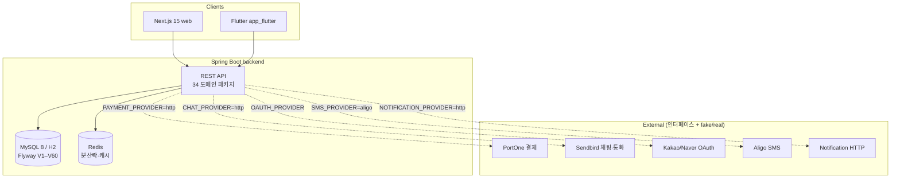

# CLAUDE.md (Monorepo Root)

## Project Overview

천지연꽃신당 — Korean fortune-telling/counseling booking platform. **Monorepo**: Spring Boot 3.5 (Java 21) + Next.js 15 (React 19 + Tailwind v4) + Flutter 3.2+ (Riverpod + go_router).

응답·문서·UI 텍스트·커밋 메시지는 **한국어**.

## Architecture



## Sub-Projects

| Project | Path | Stack | CLAUDE.md |
|---------|------|-------|-----------|
| Backend | `backend/` | Spring Boot 3.5 · Java 21 · Gradle · Flyway · Redis | [backend/CLAUDE.md](./backend/CLAUDE.md) |
| Web | `web/` | Next.js 15 · React 19 · Tailwind v4 · shadcn/ui · Playwright | [web/CLAUDE.md](./web/CLAUDE.md) |
| Flutter | `app_flutter/` | Flutter 3.2+ · Riverpod · go_router · Dio | [app_flutter/CLAUDE.md](./app_flutter/CLAUDE.md) |

해당 sub 디렉토리에서 작업할 때는 **반드시 sub의 CLAUDE.md 를 우선 참조**하라.

## Cross-Cutting Rules (3 sub 모두 적용)

- **Sendbird userId 규약**: 고객 `user_{userId}`, 상담사 `counselor_{counselorId}`, 채널 `consultation-{reservationId}`. 백엔드·웹·Flutter 모두 동일 prefix — 어긋나면 채널 매칭 실패. → `.claude/docs/reference/sendbird-guide.md`
- **Provider env 한 줄 토글**: `PAYMENT_PROVIDER` / `CHAT_PROVIDER` / `NOTIFICATION_PROVIDER` / `OAUTH_PROVIDER` / `SMS_PROVIDER` 5종. 미설정 시 fake. 통합 테스트·CI 는 fake 유지. → `backend/.claude/docs/reference/provider-integration.md` (구현은 backend 책임)
- **Korean text**: 한국어 본문에는 `word-break: keep-all`, Pretendard, 헤딩에 `text-wrap: balance` (web/Flutter 공통 원칙)
- **Commit**: conventional commits (`feat`/`fix`/`refactor`/`docs`/`test`/`chore`/`perf`/`ci`)
- **응답 한국어**

## Commands (Root)

```bash
# 전체 stack 모니터링은 sub별 명령 — 자세한 건 각 sub/CLAUDE.md
cd backend && ./gradlew bootRun     # API (port 8080)
cd web && npm run dev               # web (port 3000)
cd app_flutter && flutter run       # 시뮬레이터/디바이스
docker compose up                   # MySQL + Redis + backend + web (E2E·시나리오)
```

## Reference Docs

**원칙**: sub-specific reference 는 해당 sub 의 `.claude/docs/reference/` 안에 살고, 진짜 cross-cutting 만 root 의 `/.claude/docs/reference/` 에 둔다. → ADR `docs/adr/0002-nested-reference-docs.md`.

### Cross-cutting (root `/.claude/docs/reference/`) — 3 sub 공통

| 문서 | 참조 시점 | 경로 |
|------|----------|------|
| Sendbird Guide | userId 규약 (backend·web·flutter 모두 enforce) | `.claude/docs/reference/sendbird-guide.md` |
| Environment | 환경 변수·Docker·CI/CD (operator view) | `.claude/docs/reference/environment.md` |

### Sub-local — sub 디렉토리에서 작업할 때 우선

| Sub | 디렉토리 | 포함 |
|-----|---------|------|
| backend | `backend/.claude/docs/reference/` | api-layer · service-layer · provider-integration · database-migrations · security-checklist · coding-style · testing |
| web | `web/.claude/docs/reference/` | frontend-pages · design-system · coding-style · testing |
| app_flutter | `app_flutter/.claude/docs/reference/` | architecture · coding-style · testing |

각 sub 의 reference 인벤토리는 해당 `sub/CLAUDE.md` 의 Reference Docs 섹션 참조.

ZEOM-* dev-guide (페이지 마이그레이션 이력) → `docs/ZEOM-*-dev-guide.md`.

## Verify Skills

검증 스킬 (`.claude/skills/verify-*/SKILL.md`). 변경 영역에 맞춰 호출.

| 스킬 | 적용 sub | 트리거 |
|------|---------|--------|
| `verify-flyway-migrations` | backend | Flyway/Entity 변경 |
| `verify-sendbird-videocall` | backend·web·app_flutter | 통화 코드 변경 |
| `verify-payment-wallet` | backend·web | 결제·지갑 변경 |
| `verify-frontend-ui` | web | UI 변경 |
| `verify-e2e-tests` | web | E2E spec 변경 |
| `verify-admin-auth` | backend | admin 엔드포인트 변경 |
| `verify-auth-system` | backend·web·app_flutter | auth 변경 |
| `verify-notification-system` | backend | 알림 변경 |
| `verify-flutter-app` | app_flutter | Flutter 변경 |
| `verify-fortune` | backend·web | 운세 도메인 변경 |
| `verify-seo-analytics` | web | SEO/GA 변경 |
| `verify-implementation` | 모든 sub | PR 직전 통합 |

## Harness Engineering Integration

**운영 모드**: `HARNESS_MODE` (`.claude/settings.local.json`, 현재 `auto`).
- `auto`: hook 이 harness 단계 강제 주입 + `git commit` 게이트 차단 (verdict `ITERATE`/`ESCALATE` 시)
- `suggest`: 제안만 / `off`: 비활성

**워크플로**: `/jira-plan` → `/harness-plan` → `/jira-execute` (Phase 별 `/harness-review`) → `/jira-commit` (전 `aggregate-verdict.md` 확인).

**에이전트 디스패치** (zeom-* 우선):
- Entity/Repository → `zeom-jpa-reviewer`
- Controller/DTO/openapi.yaml → `zeom-api-contract-reviewer` + `zeom-security-reviewer`
- `/api/v1/admin/**` → `zeom-admin-guard-reviewer` (필수)
- Service → `zeom-cqrs-refactorer`
- payment/chat/notification/oauth/sms provider → `zeom-provider-pattern-reviewer`
- `web/src/**/*.tsx` → `zeom-component-reviewer`
- 빌드 실패 → `zeom-build-resolver` / 테스트 → `zeom-test-writer` / 탐색 → `zeom-explorer`

**아티팩트**:
- dev-guide: `docs/{ISSUE-KEY}-dev-guide.md`
- Sprint Contract: `.claude/runtime/sprint-contract/{ISSUE-KEY}.md`
- Verdict: `.claude/runtime/aggregate-verdict.md` / State: `.claude/runtime/workflow-state.json`
- Metrics: `.claude/runtime/harness-metrics/scorecard.md` (집계: `bash .claude/runtime/harness-metrics/aggregate.sh`)

## Decisions (ADR)

구조 결정은 `docs/adr/` 에 기록. 최신: `0001-claude-md-monorepo-split.md` (sub 별 CLAUDE.md 분할 결정).

---
Last Updated: 2026-05-17
