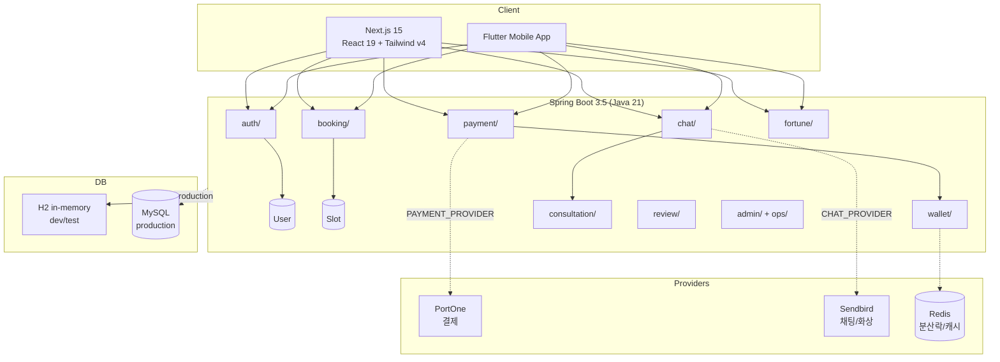

# CLAUDE.md

## Project Overview

천지연꽃신당 — Korean fortune-telling/counseling booking platform. Full-stack monorepo: Spring Boot 3.5 (Java 21) + Next.js 15 (React 19) + Flutter.

## Architecture



## Commands

```bash
# Backend (port 8080)
cd backend && ./gradlew bootRun           # Dev server (H2)
cd backend && ./gradlew test              # 19 integration tests

# Frontend (port 3000)
cd web && npm run dev                     # Dev server
cd web && npm test                        # Jest unit tests (48+)
cd web && npm run test:e2e                # Playwright E2E (auto-starts backend)

# Flutter
cd app_flutter && flutter run             # Run on device/simulator
cd app_flutter && flutter test            # Widget + unit tests
```

## Key Rules

- **Design tokens**: ALL colors use `hsl(var(--xxx))` — never hardcode hex. See `.claude/docs/reference/design-system.md`
- **Provider pattern**: External services (payment/chat/notification) use pluggable `fake` (dev) vs real providers
- **Flyway only**: All DB schema changes go through `db/migration/` — JPA `ddl-auto: none`
- **Compensation strategy**: Payment persisted first; downstream failures log `*_retry_needed` + webhook alert
- **Korean text**: `word-break: keep-all`, Pretendard font, `text-wrap: balance` on headings

## Path Aliases

- `@/` → `src/` (tsconfig.json + jest.config.js `moduleNameMapper`)

## Monorepo Structure

```
backend/    Spring Boot 3.5 API (Java 21, Gradle, Flyway V1-V19)
web/        Next.js 15 frontend (Tailwind v4, shadcn/ui, Playwright)
app_flutter/ Flutter mobile app (feature complete)
docs/       Architecture docs, OpenAPI spec, design plans
```

## Design System (Organic Warmth Dark)

- **Fonts**: Pretendard (body) + Geist (headings) — CDN loaded
- **Palette**: Gold `hsl(43,70%,46%)` accent on warm dark `hsl(24,15%,5%)` background
- **Cards**: 3 variants — `surface` / `glass` / `elevated` (see `components/ui.tsx`)
- **Tokens**: `--gold`, `--surface`, `--text-primary`, `--text-secondary`, `--dancheong`, `--lotus`
- **No emoji in UI** — use Lucide React icons
- **Token unification**: 100% complete (api/og route excluded — ImageResponse requires hex)

## Reference Docs

| 문서 | 참조 시점 | 경로 |
|------|----------|------|
| Design System | UI 컴포넌트/색상/폰트 작업 시 | `.claude/docs/reference/design-system.md` |
| Backend API | API 엔드포인트 추가/수정 시 | `.claude/docs/reference/backend-api.md` |
| Testing | 테스트 작성/수정 시 | `.claude/docs/reference/testing.md` |
| Environment | 환경 변수/배포 설정 시 | `.claude/docs/reference/environment.md` |
| Frontend Pages | 페이지 추가/수정 시 | `.claude/docs/reference/frontend-pages.md` |

## Skills

검증 스킬 (`.claude/skills/verify-*/SKILL.md`):

| 스킬 | 설명 |
|------|------|
| `verify-flyway-migrations` | Flyway DB 마이그레이션과 JPA Entity 일관성 검증 |
| `verify-sendbird-videocall` | Sendbird 화상통화 파이프라인 검증 |
| `verify-payment-wallet` | 결제/지갑/크레딧 시스템 무결성 검증 |
| `verify-frontend-ui` | 프론트엔드 UI/디자인 시스템 품질 검증 |
| `verify-e2e-tests` | E2E 테스트 설정 및 품질 검증 |
| `verify-admin-auth` | Admin API 엔드포인트 인증/인가 가드 검증 |
| `verify-auth-system` | 인증/인가 시스템 무결성 검증 |
| `verify-notification-system` | 알림/이메일/SMS 시스템 무결성 검증 |
| `verify-flutter-app` | Flutter 앱 품질 및 React-Flutter UX 동기화 검증 |
| `verify-fortune` | 운세 엔진 도메인 무결성 검증 |
| `verify-seo-analytics` | SEO/GA4/온보딩 시스템 무결성 검증 |
| `verify-implementation` | 통합 검증 (위 스킬 순차 실행) |
| `manage-skills` | 검증 스킬 유지보수 및 드리프트 탐지 |

## Conventions

- Commit: conventional commits (`feat`, `fix`, `refactor`, `docs`, `test`, `chore`, `perf`, `ci`)
- Korean in documentation, commit bodies, UI text, code comments
- OpenAPI spec at `docs/openapi.yaml`
- No ESLint/Prettier or Checkstyle configured
