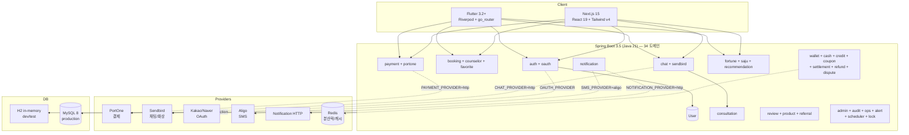

# CLAUDE.md

## Project Overview

천지연꽃신당 — Korean fortune-telling/counseling booking platform. Full-stack 모노레포: Spring Boot 3.5 (Java 21) + Next.js 15 (React 19) + Flutter.

## Architecture



## Commands

```bash
# Backend (port 8080) — H2 in-memory, fake providers
cd backend && ./gradlew bootRun
cd backend && ./gradlew test                      # 31 integration test classes

# Frontend (port 3000)
cd web && npm run dev
cd web && npm test                                # Jest 30 (12 spec files)
cd web && npm run test:e2e                        # Playwright (18 specs, backend 자동 시작)

# Flutter — 디바이스/시뮬레이터에 직접 실행 (build만 X)
cd app_flutter && flutter run
cd app_flutter && flutter test
```

## Key Rules

- **Design tokens**: 모든 색상은 `hsl(var(--xxx))` — hex 하드코딩 금지. 토큰은 `web/src/app/globals.css` 의 `@theme inline` 블록. 상세 → `design-system.md`
- **Provider pattern**: 외부 통합 5종(payment/chat/notification/oauth/sms)은 인터페이스 + fake/real + `@ConditionalOnProperty` 자동선택. 직접 SDK 주입 금지 → `provider-integration.md`
- **Sendbird userId 규약**: 고객 `user_{id}`, 상담사 `counselor_{id}`. 채널 `consultation-{reservationId}`. 클라이언트도 동일 prefix 사용. → `sendbird-guide.md`
- **Flyway only**: 모든 스키마 변경은 `db/migration/V<n>__<desc>.sql`. 적용된 파일 수정 금지 (체크섬 위반 → 부팅 실패). → `database-migrations.md`
- **결제 보상 전략**: 결제는 DB 먼저 영속화, 후속(채널 생성/알림) 실패는 `*_retry_needed` 플래그 + 웹훅 알림 + 스케줄러 재시도
- **Admin 가드**: 모든 `/api/v1/admin/**` 컨트롤러는 첫 줄에 `authService.requireAdmin(authHeader)`. → `security-checklist.md`
- **Korean text**: `word-break: keep-all`, Pretendard, 헤딩에 `text-wrap: balance`

## Path Aliases

- `@/` → `web/src/` (tsconfig.json + jest.config.js `moduleNameMapper`)

## Monorepo Structure

```
backend/      Spring Boot 3.5 API (Java 21, Gradle, Flyway V1–V60)
web/          Next.js 15 (App Router, Tailwind v4, shadcn/ui, Playwright)
app_flutter/  Flutter (Riverpod + go_router + Dio, 11 features)
docs/         Architecture, OpenAPI spec, PRD, design plans
```

## Reference Docs

작업 종류별로 아래 문서를 읽으세요:

| 문서 | 참조 시점 | 경로 |
|------|----------|------|
| Backend API | API 엔드포인트 추가/수정 시 | `.claude/docs/reference/backend-api.md` |
| Service Layer | 도메인 서비스/트랜잭션/예외 작업 시 | `.claude/docs/reference/service-layer.md` |
| Provider Integration | 외부 SDK 통합 (fake/real) 작업 시 | `.claude/docs/reference/provider-integration.md` |
| Sendbird Guide | 채팅/화상통화 작업 시 | `.claude/docs/reference/sendbird-guide.md` |
| Database & Migrations | 스키마/마이그레이션 작업 시 | `.claude/docs/reference/database-migrations.md` |
| Security Checklist | 인증/admin/CORS/멱등성 작업 시 | `.claude/docs/reference/security-checklist.md` |
| Frontend Pages | 페이지/라우팅 작업 시 | `.claude/docs/reference/frontend-pages.md` |
| Design System | UI 컴포넌트/색상/폰트 작업 시 | `.claude/docs/reference/design-system.md` |
| Flutter Architecture | Flutter feature/라우팅 작업 시 | `.claude/docs/reference/flutter-architecture.md` |
| Testing | 테스트 작성/수정 시 | `.claude/docs/reference/testing.md` |
| Environment | 환경 변수/배포 설정 시 | `.claude/docs/reference/environment.md` |

## Skills

검증 스킬 (`.claude/skills/verify-*/SKILL.md`):

| 스킬 | 설명 |
|------|------|
| `verify-flyway-migrations` | Flyway 마이그레이션과 JPA Entity 일관성 |
| `verify-sendbird-videocall` | Sendbird 화상통화 파이프라인 |
| `verify-payment-wallet` | 결제/지갑/크레딧 시스템 무결성 |
| `verify-frontend-ui` | 프론트엔드 UI/디자인 시스템 품질 |
| `verify-e2e-tests` | E2E 테스트 설정 및 품질 |
| `verify-admin-auth` | Admin API 인증/인가 가드 |
| `verify-auth-system` | 인증/인가 시스템 무결성 |
| `verify-notification-system` | 알림/이메일/SMS 시스템 |
| `verify-flutter-app` | Flutter 앱 품질 및 React-Flutter UX 동기화 |
| `verify-fortune` | 운세 엔진 도메인 무결성 |
| `verify-seo-analytics` | SEO/GA4/온보딩 시스템 |
| `verify-implementation` | 통합 검증 (위 스킬 순차 실행) |

## Conventions

- Commit: conventional commits (`feat`, `fix`, `refactor`, `docs`, `test`, `chore`, `perf`, `ci`)
- 한국어: 문서/PR 본문/UI 텍스트/코드 주석
- OpenAPI spec: `docs/openapi.yaml`
- ESLint/Prettier/Checkstyle 미설정 (린터 의존 컨벤션 작성 금지)

<!-- 갱신 이력
2026-04-25: V1-V19→V60 동기화, 도메인 8→34 반영, provider 3→5 반영, 테스트 카운트 보정, reference 6개 추가(service-layer, provider-integration, sendbird-guide, database-migrations, security-checklist, flutter-architecture), .claude/rules/migration-safety.md 추가, design-system 중복 섹션 제거(reference로 일원화)
-->
