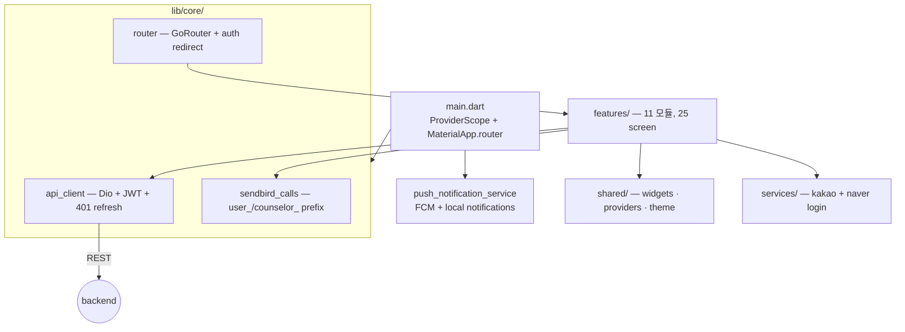

# CLAUDE.md (app_flutter)

## Project Overview

Flutter `>=3.2.0 <4.0.0` 모바일 앱. **Riverpod** (`flutter_riverpod ^2.4.9`) 상태 관리 + **go_router** (`^13.0.0`) + **Dio** (`^5.4.0`) HTTP + **flutter_secure_storage** (`^9.0.0`) JWT. 11 feature 모듈, 25 screen, FCM 푸시, Kakao/Naver SDK 통합. 백엔드 도메인과 1:1 매핑.

**Monorepo root**: 상위 [`/CLAUDE.md`](../CLAUDE.md) 의 cross-cutting rule (Sendbird userId 규약, conventional commits, Korean) 도 함께 적용.

## Architecture



## Commands

```bash
flutter pub get                          # 의존성
flutter run                              # 시뮬레이터/디바이스에 실제 실행 (build만 X)
flutter test                             # widget + unit
flutter test integration_test/           # 통합
flutter analyze                          # 정적 분석 (analysis_options.yaml)
flutter clean && flutter pub get         # 캐시 이슈 시
```

## Key Rules

- **`flutter run` 으로 실제 실행 — `flutter build` 만 하지 말 것**: 시뮬레이터/디바이스에 직접 띄워서 동작 확인. build 산출물만으로는 라우팅·인증·통화 가드 검증 불가.
- **API 호출은 `apiClientProvider` (Dio) 만 — `http` 패키지 직접 사용 금지**: `core/api_client.dart` 의 `InterceptorsWrapper` 가 (1) `flutter_secure_storage` 토큰을 `Authorization` 헤더로 자동 주입, (2) 401 발생 시 `/api/v1/auth/refresh` 호출 후 요청 재시도. `http` 패키지 직접 사용 시 두 가지 모두 누락.
- **JWT 는 `flutter_secure_storage` 만 — `SharedPreferences` 금지**: iOS Keychain / Android Keystore 사용. `SharedPreferences` 는 평문 저장이라 토큰 유출 위험.
- **라우팅은 GoRouter `context.go()` / `context.push()` — `Navigator.push` 직접 호출 금지**: `core/router.dart` 의 `redirect:` 콜백이 secure storage 토큰 존재로 인증 가드. `Navigator.push` 사용 시 가드 우회 + 딥링크 비호환.
- **Sendbird userId 규약** (cross-cutting): `user_{userId}` / `counselor_{counselorId}` prefix 사용 — 백엔드 `SendbirdClient.java` 와 동일. 안 그러면 채널 매칭 실패. 채널 `consultation-{reservationId}`.
- **비동기 데이터는 Riverpod `AsyncValue` — `setState` 로 비동기 결과 반영 금지**: `AsyncNotifierProvider` 로 loading/error/data 분기. 단순 위젯 내부 상태만 `StatefulWidget`. 글로벌 상태 (auth, wallet, active_session) 는 `shared/providers/`.
- **PushNotificationService 는 main.dart 에서 1회 초기화**: Firebase config 의존 — `pushService.initialize()` 후 `onNotificationTap` 스트림 구독 → `PushNotificationService.resolveRoute(data)` 로 라우터 이동.

## Project Structure (요약)

```
lib/
├── main.dart                    ProviderScope + MaterialApp.router + push init
├── core/                        api_client · router · push_notification_service · sendbird_calls_service
├── features/                    11 모듈, 25 screen
│                                  auth (login/signup/onboarding) · home (MainScreen 5탭)
│                                  counselor + booking · consultation (preflight/room/complete/history/review)
│                                  wallet + credit + refund + dispute · fortune (+saju_chart) · more
├── services/                    kakao_login_service · naver_login_service
└── shared/
    ├── widgets/                 zeom_* 11개 (app_bar/avatar/button/chip/countdown/hero_card/
    │                            lotus_mandala/presence_dot/star_rating/status_bar/tab_bar)
    ├── providers/               active_session · bookings · pending_booking · wallet
    └── theme.dart               ZeomType + AppTheme
```

## Routing (`core/router.dart`)

`redirect:` 콜백이 인증 가드 — 인증 X + 보호 라우트 → `/login` / 인증 O + `/login`·`/signup` → `/home`. `/home`·`/counselors`·`/bookings`·`/wallet`·`/more` 는 `MainScreen(initialIndex: 0~4)` 5탭. 추가로 `/counselor/:id`, `/booking/create`, `/consultation/...`, `/fortune`, `/saju`, `/refund/...`, `/dispute/...`.

## Reference Docs

**Flutter 로컬** (`app_flutter/.claude/docs/reference/`) — sub 단독 작업 시 우선 참조:

| 문서 | 시점 | 경로 |
|------|------|------|
| Architecture | feature·라우팅·API·상태·decision tree | `.claude/docs/reference/architecture.md` |
| Coding Style | Dart/Flutter 컨벤션 + Riverpod 패턴 | `.claude/docs/reference/coding-style.md` |
| Testing | widget + integration | `.claude/docs/reference/testing.md` |

**Cross-cutting** (`/.claude/docs/reference/` at monorepo root) — 3 sub 공통:

| 문서 | 시점 | 경로 |
|------|------|------|
| Sendbird Guide | 통화 (userId/채널 규약) | `../.claude/docs/reference/sendbird-guide.md` |
| Environment | 환경 변수 (Firebase·OAuth secret) | `../.claude/docs/reference/environment.md` |

**Backend cross-sub** — 호출하는 엔드포인트 contract 확인 필요 시:

| 문서 | 시점 | 경로 |
|------|------|------|
| Backend API Layer | 엔드포인트·요청/응답 형식 | `../backend/.claude/docs/reference/api-layer.md` |
| Backend Security | JWT 헤더·OAuth 흐름 | `../backend/.claude/docs/reference/security-checklist.md` |

## Verify Skills

- `verify-flutter-app` (Flutter 품질 + React-Flutter UX 동기화), `verify-sendbird-videocall` (통화 클라이언트), `verify-auth-system` (auth)

---
Last Updated: 2026-05-17
