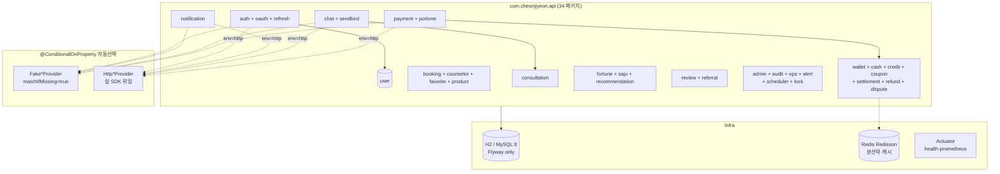

# CLAUDE.md (backend)

## Project Overview

Spring Boot 3.5.0 (Java 21) REST API. 34 도메인 패키지, 44+ 컨트롤러, 50+ 서비스, 39 Repository, 31 통합 테스트 클래스. Flyway V1–V60 (계속 증가). H2 (dev/test) / MySQL 8 (production).

**Monorepo root**: 상위 [`/CLAUDE.md`](../CLAUDE.md) 의 cross-cutting rule (Sendbird userId 규약, Provider env 토글, conventional commits) 도 함께 적용.

## Architecture



## Commands

```bash
./gradlew bootRun                       # H2 in-memory + fake providers (port 8080)
./gradlew test                          # 31 통합 테스트 (H2, fake providers)
./gradlew test --tests '*AuthSession*'  # 단일 클래스
./gradlew compileJava                   # 빌드 검증
# Docker (MySQL 호환성 검증 / E2E):
docker compose up backend               # MySQL 8 + Redis + backend
```

## Key Rules

- **Flyway only — 적용된 V<n> 파일 수정 금지**. 변경 필요 시 새 버전 추가. 위반 시 `FlywayException: Migration checksum mismatch` → 부팅 실패. JPA `ddl-auto: none`. → `.claude/docs/reference/database-migrations.md`
- **Admin 가드 첫 줄**: 모든 `/api/v1/admin/**` 컨트롤러는 **첫 줄에 `authService.requireAdmin(authHeader)`** 호출. 누락 시 일반 사용자 권한 우회 — 코드 리뷰에서 가장 많이 잡힘. → `.claude/docs/reference/security-checklist.md`
- **Provider pattern — SDK 직접 주입 금지**: 5종 (payment/chat/notification/oauth/sms) 모두 인터페이스 + `@ConditionalOnProperty(matchIfMissing=true)` fake/real. 서비스는 인터페이스만 주입받음. 위반 시 테스트 격리 깨짐. → `.claude/docs/reference/provider-integration.md`
- **결제 보상 전략 — DB 먼저, 외부는 후속**: 결제는 트랜잭션에서 영속화 우선, 후속 챗 채널/알림 실패는 `*_retry_needed` 플래그 + 웹훅 알림 + 스케줄러 재시도. 외부 호출을 같은 트랜잭션에 묶으면 롤백으로 정합성 깨짐.
- **트랜잭션은 서비스 메서드** — 컨트롤러에 `@Transactional` 금지. 도메인 예외는 `ApiException(status, message)` 통일 — `GlobalExceptionHandler` 가 JSON 응답으로 변환. SDK 예외는 catch 후 `ApiException(502, ...)` 변환. → `.claude/docs/reference/service-layer.md`
- **Sendbird userId 규약** (cross-cutting 재명시): `user_{userId}` / `counselor_{counselorId}` / 채널 `consultation-{reservationId}`. `SendbirdClient.java` 가 강제. `ConsultationSessionService.startSession()` 은 **idempotent** — 같은 `reservationId` 재호출 시 기존 세션 반환. → `../.claude/docs/reference/sendbird-guide.md` (cross-cutting at root)
- **결제·잔액 멱등성**: `cash_transactions.idempotency_key UNIQUE`. `WalletService.charge()` 가 `"charge-{refType}-{refId}-{UUID}"` 발급. webhook 재전송·retry 시 두 번째 INSERT 가 unique constraint 로 안전 차단. 동시성 위험 영역은 `DistributedLock.executeWithLock(...)` (Redisson).
- **CORS + credentials**: `allowCredentials(true)` 라 origin 와일드카드 금지. 운영 도메인 명시. webhook 헤더 (`X-Webhook-Secret`) 허용 목록 유지.

## Environment

`application.yml` 의 `${VAR:default}` 패턴 — 환경 변수 미설정 시 fake 가 기본.

**Core**: `JWT_SECRET` (32+) · `DB_URL`/`DB_USER`/`DB_PASSWORD` · `REDIS_HOST`/`REDIS_PORT`
**Providers**: `PAYMENT_PROVIDER` (`fake`|`http`) + `PORTONE_*` · `CHAT_PROVIDER` + `SENDBIRD_APP_ID`/`SENDBIRD_API_TOKEN` · `NOTIFICATION_PROVIDER` + `NOTIFICATION_HTTP_*` · `OAUTH_PROVIDER` (`fake`|`kakao`|`naver`) + `OAUTH_KAKAO_*`/`OAUTH_NAVER_*` · `SMS_PROVIDER` (`fake`|`aligo`) + `ALIGO_*`
**Testing**: `AUTH_ALLOW_E2E_ADMIN_BOOTSTRAP=true` (Playwright 필수)
**Other**: `ALERTS_WEBHOOK_URL` · `CORS_ALLOWED_ORIGINS` · `SCHEDULER_*_CRON` · `FRONTEND_BASE_URL`

자세한 키와 fallback 은 `../.claude/docs/reference/environment.md` (cross-cutting at root) + `application.yml`.

## Domain Modules (대표)

| Package | Purpose |
|---------|---------|
| `auth/` + `oauth/` | JWT (쿠키+헤더 양립), refresh (multi-device), Kakao/Naver |
| `booking/` + `counselor/` + `favorite/` + `product/` | 예약·상담사·즐겨찾기·상품 |
| `payment/` + `portone/` | 결제 의도·확정·webhook (PortOne 위임) |
| `wallet/` + `cash/` + `credit/` + `coupon/` | 캐시·크레딧·쿠폰 (멱등성) |
| `settlement/` + `refund/` + `dispute/` | 정산·환불·분쟁 |
| `chat/` + `sendbird/` + `consultation/` | 채팅·통화 세션 (idempotent start) |
| `fortune/` (+ `saju/`) + `recommendation/` | 운세 (today/zodiac/compatibility/사주) + 추천 |
| `notification/` + `alert/` | 알림 dispatch + webhook |
| `admin/` + `audit/` + `ops/` + `scheduler/` + `lock/` | 운영·감사·스케줄·분산락 |
| `config/` + `common/` | CORS·CookieAuthFilter·Redis·ApiException·GlobalExceptionHandler |

자세한 책임 분리 → `.claude/docs/reference/api-layer.md`.

## Reference Docs

**Backend 로컬** (`backend/.claude/docs/reference/`) — sub 단독 작업 시 우선 참조:

| 문서 | 시점 | 경로 |
|------|------|------|
| API Layer | 엔드포인트 추가/수정 | `.claude/docs/reference/api-layer.md` |
| Service Layer | 서비스·트랜잭션·예외 | `.claude/docs/reference/service-layer.md` |
| Provider Integration | 외부 SDK fake↔real | `.claude/docs/reference/provider-integration.md` |
| Database & Migrations | Flyway · Entity 동기화 | `.claude/docs/reference/database-migrations.md` |
| Security Checklist | 인증·admin·CORS·멱등성 | `.claude/docs/reference/security-checklist.md` |
| Coding Style | Java/Spring 컨벤션 | `.claude/docs/reference/coding-style.md` |
| Testing | 통합 테스트 (JUnit5) | `.claude/docs/reference/testing.md` |

**Cross-cutting** (`/.claude/docs/reference/` at monorepo root) — 3 sub 공통:

| 문서 | 시점 | 경로 |
|------|------|------|
| Sendbird Guide | 채팅·통화 (userId/채널 규약) | `../.claude/docs/reference/sendbird-guide.md` |
| Environment | 환경 변수·Docker·CI/CD | `../.claude/docs/reference/environment.md` |

## Verify Skills

- `verify-flyway-migrations` (Flyway/Entity), `verify-admin-auth` (admin 가드), `verify-auth-system` (auth 무결성), `verify-payment-wallet` (결제·지갑), `verify-sendbird-videocall` (통화), `verify-notification-system` (알림), `verify-fortune` (운세)

---
Last Updated: 2026-05-17
